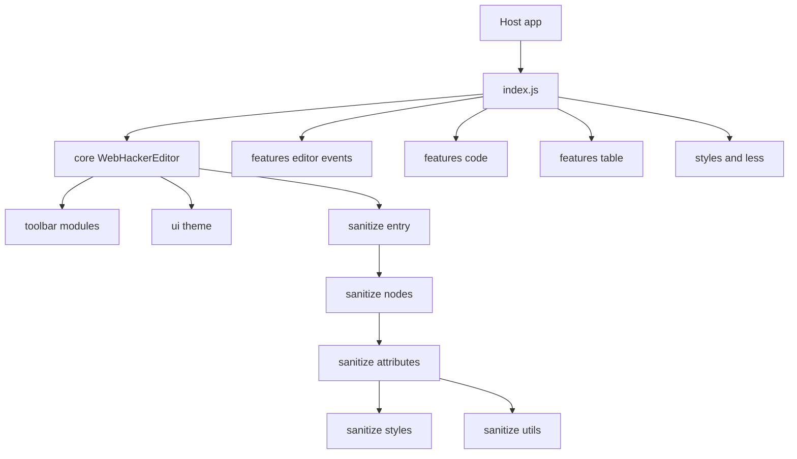
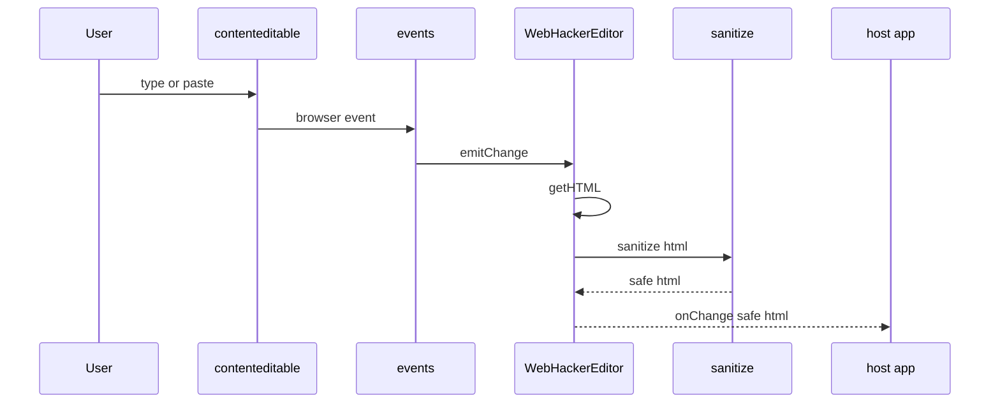
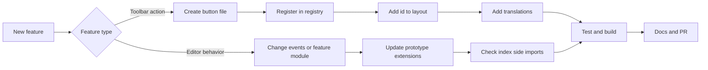
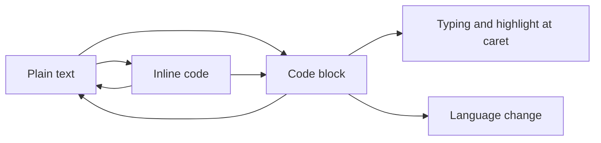
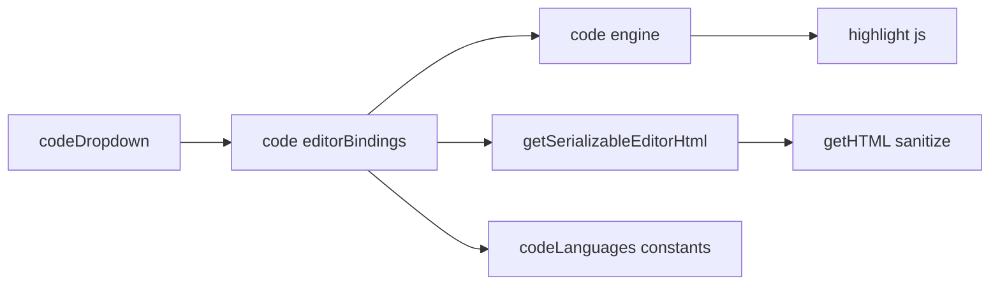

# Визуальные карты проекта

Ниже те же идеи, но в формате диаграмм.

## 1) Карта модулей проекта

Как читать:
1. `index.js` - центральная точка сборки;
2. `core` держит каркас;
3. `features` добавляют поведение;
4. sanitize - отдельный защитный слой.

## 2) Поток данных от пользователя к API

Как читать:
1. события идут через `events/*`;
2. наружу отправляется только safe-html;
3. sanitize встроен в путь `getHTML`.

## 3) Как добавить новый функционал

Как читать:
1. сначала определить тип задачи;
2. потом пройти свой обязательный маршрут;
3. в финале всегда тесты и документация.

## 4) Жизненный цикл code block

Как читать:
1. `Inline code` и `Code block` - разные режимы;
2. у `Code block` есть свои действия: язык, подсветка, выход.

## 5) Модули code block

Как читать:
1. dropdown запускает поведение;
2. bindings управляет курсором и UI;
3. engine отвечает за подсветку;
4. сериализация убирает служебные элементы перед сохранением.

## 6) Где искать баг по симптомам

1. не работает включение блока кода: `features/editor/toolbar/buttons/codeDropdown.js`
2. сдвигается курсор внутри кода: `features/code/editorBindings.js`
3. не меняется язык: `constants/codeLanguages.js` и `features/code/editorBindings.js`
4. нет подсветки: `features/code/engine.js`
5. в сохранении лишний UI: `getSerializableEditorHtml` в `features/code/editorBindings.js`

## 7) Что читать после диаграмм

1. [02-architecture.md](./02-architecture.md)
2. [03-toolbar.md](./03-toolbar.md)
3. [06-recipes.md](./06-recipes.md)
